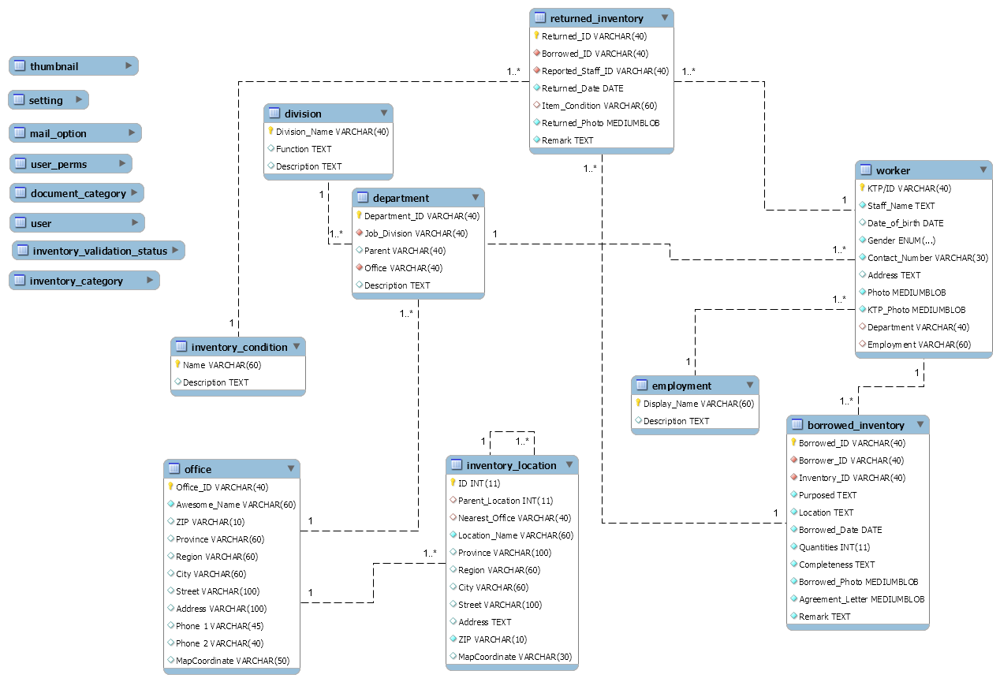

This application is flat designed for existing database structure.

## Primarily:

- office
- location
- department
- employer
- inventory
- loan (borrow/return)
- document archive
- user & their roles


## Breakdown:




## Step for deployment:

- import/dump data schema from [schema/database_structure.sql](schema/database_structure.sql).
  - if was failing when import sql at view creation, kindly to try import with [shema/inventory_loans_condition.sql](shema/inventory_loans_condition.sql).
- Change DB Connection,

 ```
//phpgen_settings.php
function GetGlobalConnectionOptions()
{
    return
        array(
         'server' => 'server host',
            'port' => '3306',
            'username' => 'username',
            'database' => 'db_name',
            'password'=>'pwd',
            'client_encoding' => 'utf8'
        );
}
 ```


## For more documentation/help :

 - [https://www.sqlmaestro.com/products/mysql/phpgenerator/help/](https://www.sqlmaestro.com/products/mysql/phpgenerator/help/).


